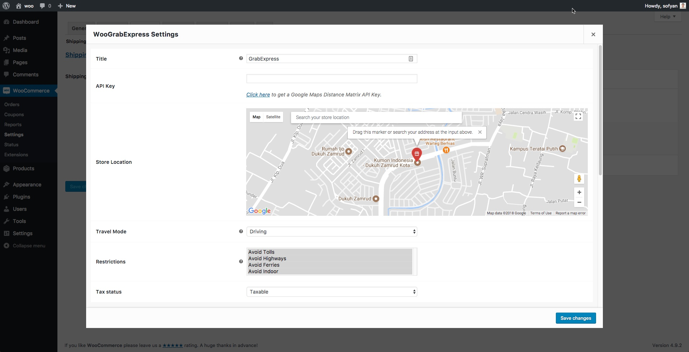
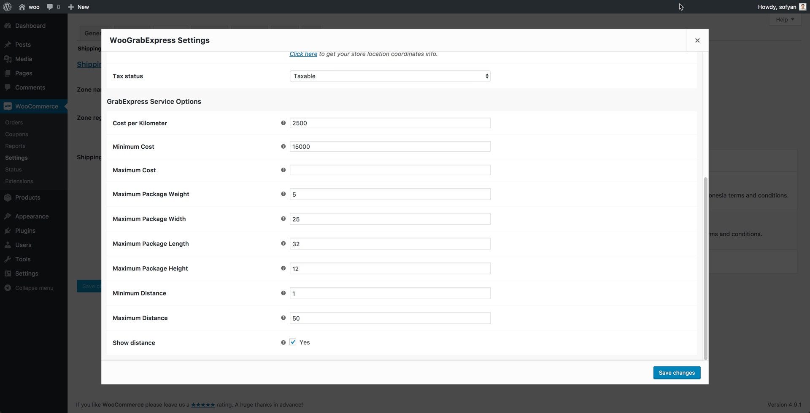
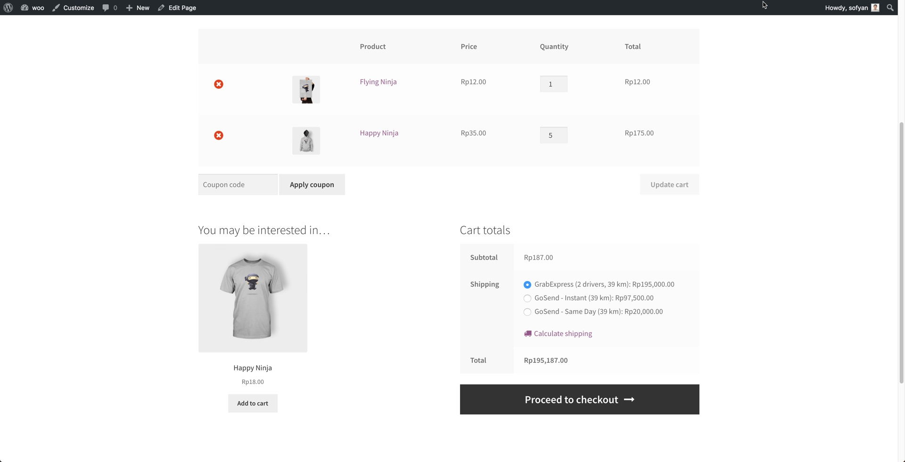

<!-- DO NOT EDIT THIS FILE; it is auto-generated from readme.txt -->
# WooGrabExpress

WooCommerce per kilometer shipping rates calculator for GrabExpress Grab Indonesia courier.

**Contributors:** [sofyansitorus](https://profiles.wordpress.org/sofyansitorus) 
**Tags:** [woocommerce shipping](https://wordpress.org/plugins/tags/woocommerce shipping), [ojek online](https://wordpress.org/plugins/tags/ojek online), [ojek shipping](https://wordpress.org/plugins/tags/ojek shipping), [grab express](https://wordpress.org/plugins/tags/grab express), [grab shipping](https://wordpress.org/plugins/tags/grab shipping) 
**Requires at least:** 4.8 
**Tested up to:** 4.9.2 
**Stable tag:** trunk (master) 
**License:** [GPL-2.0+](http://www.gnu.org/licenses/gpl-2.0.txt) 
**Requires PHP:** 5.6 

## Description ##

WooCommerce per kilometer shipping rates calculator for GrabExpress Grab Indonesia courier.

Please note that this plugin is not using official Grab Indonesia API. This plugin just estimate the distance matrix using using Google Maps Distance Matrix API and then calculating the cost using the rates defined in the settings.

This plugin require Google Maps Distance Matrix API Services enabled in your Google Console. [Click here](https://developers.google.com/maps/documentation/distance-matrix/get-api-key) to get API Key and to enable the services.
### Features ###
* Automatically split shipping for multiple items into several drivers if the package size exceeded package weight and dimensions limitation.
* Set shipping cost per kilometer.
* Set minimum cost that will be billed to customer.
* Set maximum cost that will be billed to customer.
* Set minimum shipping distances that allowed to use the courier.
* Set maximum shipping distances that allowed to use the courier.
* Set maximum package weight and dimensions that allowed to use the courier.
* Set shipping origin info by coordinates using "Map Address Picker".
* Set travel mode: Driving, Walking, Bicycling.
* Set route restrictions: Avoid Tolls, Avoid Highways, Avoid Ferries, Avoid Indoor.
* Set visibility distance info to customer.

## Installation ##

### Minimum Requirements ###
* WordPress 4.8 or later
* WooCommerce 3.0 or later

### AUTOMATIC INSTALLATION ###
Automatic installation is the easiest option as WordPress handles the file transfers itself and you don’t even need to leave your web browser. To do an automatic install of WooGrabExpress, log in to your WordPress admin panel, navigate to the Plugins menu and click Add New.

In the search field type “WooGrabExpress” and click Search Plugins. You can install it by simply clicking Install Now. After clicking that link you will be asked if you’re sure you want to install the plugin. Click yes and WordPress will automatically complete the installation. After installation has finished, click the ‘activate plugin’ link.

### MANUAL INSTALLATION ###
1. Download the plugin zip file to your computer
1. Go to the WordPress admin panel menu Plugins > Add New
1. Choose upload
1. Upload the plugin zip file, the plugin will now be installed
1. After installation has finished, click the ‘activate plugin’ link

## Frequently Asked Questions ##

### How to set the plugin settings? ###
You can setup the plugin setting from the Shipping Zones settings. Please check the following video tutorial how to setup the WooCommerce Shipping Zones:

[Video](https://www.youtube.com/watch?v=eThWmrnBP38) by [InMotion Hosting](https://www.inmotionhosting.com)

### Where can I get support? ###
You can either create ticket at plugin support forum or GitHub repository:

* [Plugin Support Forum](https://wordpress.org/support/plugin/woograbexpress)
* [Plugin GitHub Repository](https://github.com/sofyansitorus/WooGrabExpress)

### Where can I report bugs? ###
You can either create ticket at plugin support forum or GitHub repository:

* [Plugin Support Forum](https://wordpress.org/support/plugin/woograbexpress)
* [Plugin GitHub Repository](https://github.com/sofyansitorus/WooGrabExpress)

### Where can I request a feature? ###
You can either create ticket at plugin support forum or GitHub repository:

* [Plugin Support Forum](https://wordpress.org/support/plugin/woograbexpress)
* [Plugin GitHub Repository](https://github.com/sofyansitorus/WooGrabExpress)

## Screenshots ##

### Settings panel: General Options

### Settings panel: GrabExpress Service Options

### Shipping Calculator preview

## Changelog ##

### 1.2.2 ###
* Fix - Maps picker.

### 1.2.1 ###
* Fix - Cleaning up the js code.

### 1.2.0 ###
* Improvemnets - Add "Map Location Picker" for store location setting.

### 1.1.1 ###
* Improvemnets - Add "Settings" link on the plugins.php page.

### 1.1.0 ###
* Improvements - Add new settings field to enable or disabled multiple drivers function.
* Fix - A non-numeric value encountered warning.

### 1.0.3 ###
* Improvements - Add new filter hooks: woocommerce_woograbexpress_shipping_destination_info.
* Improvements - Add new filter hooks: woocommerce_woograbexpress_shipping_origin_info.

### 1.0.2 ###
* Improvement - Tweak settings panel UI and default value.

### 1.0.1 ###
* Improvement - Set cost based on drivers counts needed.
* Improvement - Add validation for settings field: gmaps_api_key, origin_lat, origin_lng.

### 1.0.0 ###
* Feature - Automatically split shipping for multiple items into several drivers if the package size exceeded package weight and dimensions limitation.
* Feature - Set shipping cost per kilometer.
* Feature - Set minimum cost that will be billed to customer.
* Feature - Set maximum cost that will be billed to customer.
* Feature - Set minimum shipping distances that allowed to use the courier.
* Feature - Set maximum shipping distances that allowed to use the courier.
* Feature - Set maximum package weight and dimensions that allowed to use the courier.
* Feature - Set shipping origin info by coordinates.
* Feature - Set travel mode: Driving, Walking, Bicycling.
* Feature - Set route restrictions: Avoid Tolls, Avoid Highways, Avoid Ferries, Avoid Indoor.
* Feature - Set visibility distance info to customer.

## Upgrade Notice ##

### 1.2.2 ###
This version include bug fix Maps Picker. Upgrade immediately.

